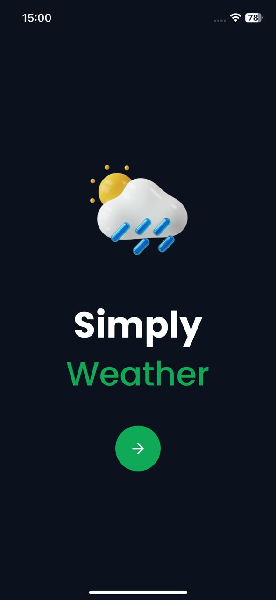

# Weather App

A simple mobile application to view the current weather for a specified location.

## Table of Contents
- [Description](#description)
- [Features](#features)
- [Installation](#installation)
- [Usage](#usage)
- [Screenshots](#screenshots)
- [Technologies Used](#technologies-used)
- [Contributing](#contributing)
- [License](#license)

## Description

This mobile application allows users to enter a city or zip code and fetches the current weather information using the Weatherstack API. The app displays the temperature, weather description, and other relevant details for the specified location.

## Features

- **Weather Data Retrieval:** Users can enter a location (city or zip code) to fetch the current weather data.
- **Display:** Display of current weather information such as temperature, weather description, etc.
- **User Interface:** Clean and user-friendly interface.
- **Error Handling:** Error handling for failed API requests.
- **Integration:** Integration with the Weatherstack API.

## Installation

To run the application locally, follow these steps:

1. **Clone the repository:**
   git clone https://github.com/ifekeyz_/weather-app.git
2. **Navigate to the project directory:**
    cd WeatherApp
3.**Install dependencies:**
    npm install
4. **Start the application:**
    npm start

## Usage

Launch the application on your mobile device or emulator. Enter a city name or zip code in the input field. Tap the "Get Weather" button to fetch the current weather information. View the displayed weather details on the screen.

## Screenshots

*Screenshot 1: Home Screen*

*Screenshot 2: Weather Input Details*

*Screenshot 3: Weather Result Details*

## Technologies Used

- [React Native]
- [Axios]
- [Weatherstack API]
- [Expo]

## Contributing

Contributions are welcome! If you find any bugs or have suggestions for improvement, please open an issue or submit a pull request.
